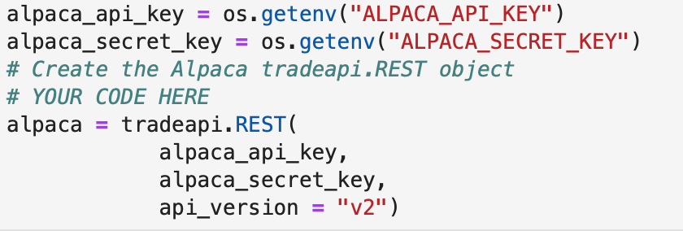
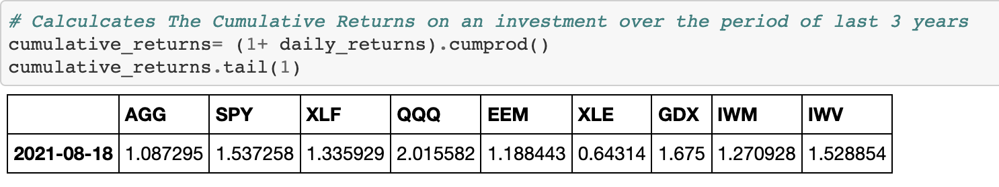
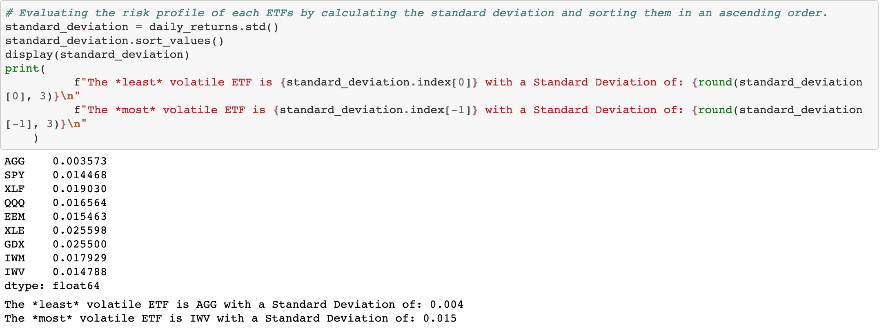
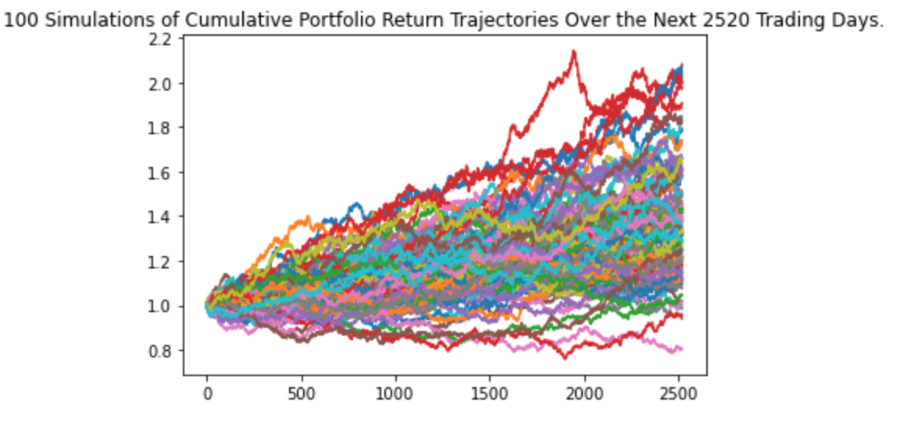

# Project_Gotham

This project evaluates 9 Exchange Traded Funds. It determines the funds with the most investment potential based on key risk-management metrics: the daily returns, standard deviations, Sharpe ratios and betas. Moreover, the project consists of interactive Monte Carlo simulations drawing on dynamic user input enabled by ipywidgets.
This Jupyter notebook contains the  data preparation, analysis, and visualizations for key risk and return metrics and Monte Carlo Simulations. This combination of fintech tools allows us to make predictions about the short or as well as long_term future.
User can use our application to analyse some of the most popular ETFs by trading volume according to ETF Database. After having done the performance analysis user can run Monte Carlo Simulations for the ETFs that suits their individual needs and preferences (i.e the level of risk that the investor is comfortable with).

## The dataset 

The dataset contains the market data accessed via Alpca SDK and covers 9 ETFs over the period of the last three years.
The dataset covers following ETFs:
"AGG", "SPY", "XLF", "QQQ", "EEM", "XLE", "GDX", "IWM", "IWV"

Disclaimer: The Basic Alpaca account doesn't adjust the historical data for stock splits and dividends. We have attempted to try to choose ETFs that didn't 
undergo any splits over the period of last three years.
To avoid this issue, it is recommended to buy an Alpaca Premium Account.

## Technologies
This project leverages python 3.7 with the following packages:
* Pandas - for financial calculations
* Path - for identifying the file
* Matplotlib - for creation of visual graphs
* Numpy - for complicated mathematical functions
* hvplot.pandas - holoview plot for interactive visualisations
* os- provides functions for interacting with the computer's operating system.
* requests - for making API calls
* json - for reading the JSON object returned by the API server
* dotenv - for protection of API keys
* alpaca_trade_api - software development kit needed for interaction with ALPACA API
* MCForecastTools - for Monte Carlo simulations
* datetime- for date/time formatting
* ipywidgets-  interactive HTML widgets for Jupyter notebooks and the IPython kernel


## Installation guide

Thsi project leverages python 3.7 with the following libraries and dependencies:

``` python
pip install python-dotenv
conda install -c anaconda requests
conda install -c jmcmurray json
pip install alpaca-trade-api
pip install matplotlib
pip install ipywidgets
```

In order to run the application you need to set up an Alpaca Markets account and obtain your perosnal API keys. You use these unique identifiers to establish an authenticated, secure connection to an API. For the security reasons you should store your unique API keys in a hidden file called .env This file protects the content of the file by hiding it in the structure of the project. To display hidden files in Jupyterlab run the following command in your terminal:

``` python
jupyter lab --ContentsManager.allow_hidden=True
```

The project accesses the Alpaca API keys from the environment variables, and stores it in a Python variables named alpaca_api_key and alpaca_secret_api_key.




## Usage








## Contributors

Brought to you as part of the UC Berkeley Extension Bootcamp: UCB-VIRT-FIN-PT-06-2021-U-B-M by:

 Ksenia Gorska 
 e-mail: kseniagorska@icloud.com 
[linkedin] (https://www.linkedin.com/in/ksenia-gorska/)

---

James Sherrer
e-mail: James.Sherrer10@gmail.com

---

Christopher McNeil
e-mail: christopher803mcneil@gmail.com


---
Srinivasa Goda
e-mail: srinivasa.goda@gmail.com


## License

MIT